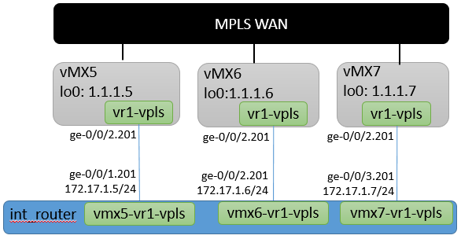

# Junos-Add-VPLS
An Ansible playbook to automatically generate and/or deploy an VPLS configuration.

# Diagram

# Lab Equipment
- PE Routers: vMX 15.1F6.9
- Internal Router: vSRX 12.1X47-D20

# Pre Configuration
1. The MPLS portion of the PE router configuration needs to be in place and operational

# Running the playbook:
1. Edit the master-vars.yml file with site specific information
2. Update the inventory file with IP address information
3. a. Build and test Netconf: ansible-playbook -i inventory build.yml
3. b. Build and deploy: ansible-playbook -i inventory build_deploy.yml
4. Configuration files outputed to: ./Configs directory

